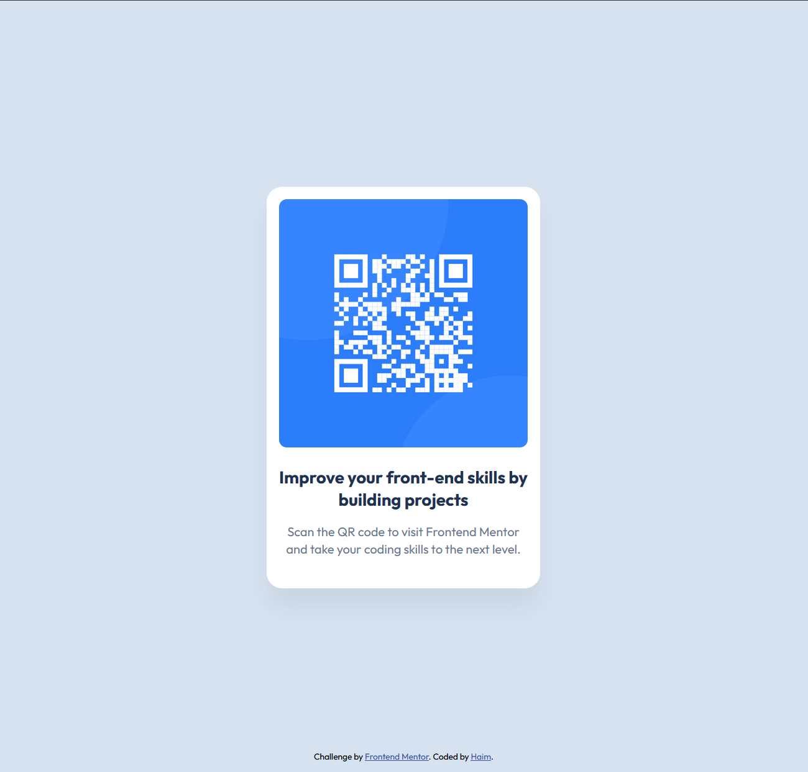

# Frontend Mentor - QR Code Component

This is my solution to the [QR Code Component challenge](https://www.frontendmentor.io/challenges/qr-code-component-iux_sIO_H) on Frontend Mentor. It's a simple and responsive card component showcasing semantic HTML and modern CSS.

## 🔗 Live Preview

- [Live Site](https://haimhamiel.github.io/qr-code-component/)
- [Solution on Frontend Mentor](https://www.frontendmentor.io/solutions/your-solution-link)

## 🛠️ Built With

- Semantic HTML5
- CSS3 (Flexbox, HSL colors, shadows, spacing)
- Google Fonts - [Outfit](https://fonts.google.com/specimen/Outfit)
- Mobile-first responsive design
- Accessibility best practices

## 💡 What I Learned

- How to center content vertically and horizontally with Flexbox
- Using semantic tags like `<main>` and `<footer>`
- Applying design tokens (colors, spacing, font weights) from a style guide
- Writing clean, scalable, and accessible markup

## 📸 Screenshot

## 👨‍💻 Author

- Frontend Mentor – [@HaimHamiel](https://www.frontendmentor.io/profile/HaimHamiel)
- GitHub – [@HaimHamiel](https://github.com/HaimHamiel)

## 🏆 Acknowledgments

Thanks to [Frontend Mentor](https://www.frontendmentor.io) for providing great real-world challenges to practice HTML and CSS skills.
---